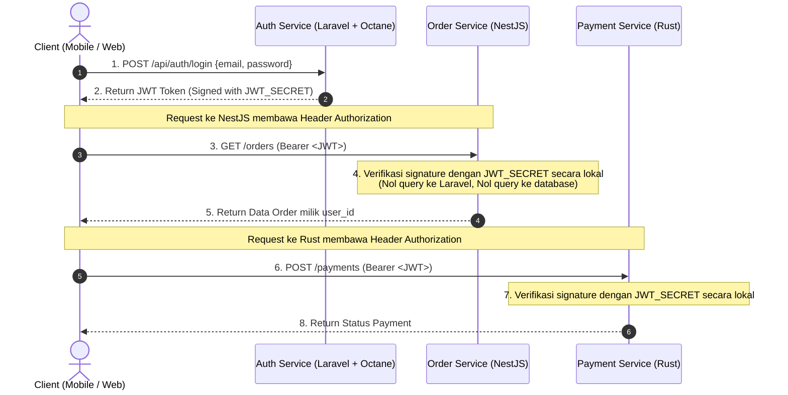

# Panduan Berbagi Autentikasi Microservices (Shared JWT Authentication)

Dokumen ini menjelaskan arsitektur dan panduan teknis bagaimana service lain (seperti **NestJS**, **Rust**, **Go**, atau **API Gateway**) memverifikasi dan menggunakan token JWT yang diterbitkan oleh **Laravel API (Auth Service)** tanpa perlu query ke database Laravel.

---

## 1. Arsitektur & Alur Kerja (Workflow)

Dalam arsitektur microservices, **Laravel API** bertindak sebagai **Identity / Auth Provider (SSO)**, sementara service lain bertindak sebagai **Resource Service**.



### Keuntungan Arsitektur Ini:
1. **True Stateless:** Microservice lain memvalidasi token secara matematis dalam memori (<0.1 ms).
2. **Decoupled:** Jika Auth Service (Laravel) sedang restart atau down sementara, service lain tetap bisa melayani request user yang sudah memiliki token valid.
3. **Multi-Bahasa:** Token standar RFC 7519 kompatibel dengan bahasa pemrograman apapun (TypeScript/NestJS, Rust, Go, Python, Java).

---

## 2. Spesifikasi Token JWT

Setiap token yang diterbitkan oleh Laravel API memiliki spesifikasi berikut:

- **Algoritma:** `HS256` (HMAC-SHA256)
- **Shared Secret:** Nilai `JWT_SECRET` yang ada di file `.env` Laravel API.
- **Format Header Request:**
  ```http
  Authorization: Bearer <token_jwt>
  ```
- **Struktur Payload (Claims):**
  ```json
  {
    "iss": "http://127.0.0.1:8000/api/auth/login",
    "iat": 1789055868,
    "exp": 1789059468,
    "nbf": 1789055868,
    "jti": "Ohz6jEVvwMj1GjU0",
    "sub": "1",
    "name": "Heris",
    "email": "heris@example.com"
  }
  ```
  - `sub`: ID Pengguna (User ID).
  - `name`: Nama pengguna.
  - `email`: Alamat email pengguna.
  - `exp`: Unix timestamp kedaluwarsa token.

---

## 3. Implementasi di Service NestJS (TypeScript)

Berikut cara memverifikasi token Laravel JWT di aplikasi **NestJS**:

### A. Instalasi Dependensi di NestJS:
```bash
npm install @nestjs/jwt @nestjs/passport passport passport-jwt
npm install --save-dev @types/passport-jwt
```

### B. Konfigurasi Environment (`.env` NestJS):
Samakan `JWT_SECRET` dengan yang ada di Laravel:
```env
JWT_SECRET=paste_nilai_jwt_secret_dari_laravel_disini
```

### C. Buat JWT Strategy (`jwt.strategy.ts`):
```typescript
import { Injectable, UnauthorizedException } from '@nestjs/common';
import { PassportStrategy } from '@nestjs/passport';
import { ExtractJwt, Strategy } from 'passport-jwt';

export interface JwtPayload {
  sub: string;
  name: string;
  email: string;
  iat: number;
  exp: number;
}

@Injectable()
export class JwtStrategy extends PassportStrategy(Strategy) {
  constructor() {
    super({
      jwtFromRequest: ExtractJwt.fromAuthHeaderAsBearerToken(),
      ignoreExpiration: false,
      secretOrKey: process.env.JWT_SECRET,
    });
  }

  async validate(payload: JwtPayload) {
    if (!payload.sub) {
      throw new UnauthorizedException('Invalid token payload');
    }
    // Return object yang akan otomatis tersedia di req.user
    return {
      userId: payload.sub,
      name: payload.name,
      email: payload.email,
    };
  }
}
```

### D. Gunakan di Controller NestJS:
```typescript
import { Controller, Get, UseGuards, Request } from '@nestjs/common';
import { AuthGuard } from '@nestjs/passport';

@Controller('orders')
export class OrderController {
  @Get()
  @UseGuards(AuthGuard('jwt'))
  getOrders(@Request() req) {
    // req.user langsung berisi data dari token Laravel:
    // { userId: '1', name: 'Heris', email: 'heris@example.com' }
    const userId = req.user.userId;
    return {
      message: `Fetching orders for user ID: ${userId}`,
      user: req.user,
    };
  }
}
```

---

## 4. Implementasi di Service Rust (Axum / Actix-Web)

Berikut cara memverifikasi token Laravel JWT di aplikasi **Rust**:

### A. Dependensi `Cargo.toml`:
```toml
[dependencies]
jsonwebtoken = "9.3"
serde = { version = "1.0", features = ["derive"] }
serde_json = "1.0"
axum = "0.7" # Atau actix-web jika menggunakan actix
tokio = { version = "1", features = ["full"] }
```

### B. Struct Claims & Fungsi Validator:
```rust
use jsonwebtoken::{decode, DecodingKey, Validation, Algorithm};
use serde::{Deserialize, Serialize};

#[derive(Debug, Serialize, Deserialize)]
pub struct Claims {
    pub sub: String,
    pub name: String,
    pub email: String,
    pub exp: usize,
}

pub fn verify_laravel_jwt(token: &str, secret: &str) -> Result<Claims, jsonwebtoken::errors::Error> {
    let key = DecodingKey::from_secret(secret.as_bytes());
    let validation = Validation::new(Algorithm::HS256);
    
    let token_data = decode::<Claims>(token, &key, &validation)?;
    Ok(token_data.claims)
}
```

### C. Contoh Extractor di Handler Axum:
```rust
use axum::{
    async_trait,
    extract::FromRequestParts,
    http::{request::Parts, StatusCode},
    response::{IntoResponse, Response},
    Json,
};
use serde_json::json;

pub struct AuthUser(pub Claims);

#[async_trait]
impl<S> FromRequestParts<S> for AuthUser
where
    S: Send + Sync,
{
    type Rejection = (StatusCode, Json<serde_json::Value>);

    async fn from_request_parts(parts: &mut Parts, _state: &S) -> Result<Self, Self::Rejection> {
        let auth_header = parts
            .headers
            .get("Authorization")
            .and_then(|value| value.to_str().ok())
            .and_then(|auth| auth.strip_prefix("Bearer "));

        let token = match auth_header {
            Some(t) => t,
            None => {
                return Err((
                    StatusCode::UNAUTHORIZED,
                    Json(json!({"success": false, "message": "Missing Bearer token"})),
                ));
            }
        };

        let secret = std::env::var("JWT_SECRET").unwrap_or_else(|_| "your-secret-here".into());

        match verify_laravel_jwt(token, &secret) {
            Ok(claims) => Ok(AuthUser(claims)),
            Err(_) => Err((
                StatusCode::UNAUTHORIZED,
                Json(json!({"success": false, "message": "Invalid or expired token"})),
            )),
        }
    }
}

// Handler endpoint:
async fn get_user_balance(AuthUser(user): AuthUser) -> Json<serde_json::Value> {
    Json(json!({
        "status": "success",
        "user_id": user.sub,
        "email": user.email,
        "name": user.name,
        "balance": 150000
    }))
}
```

---

## 5. Sinkronisasi Environment (`JWT_SECRET`)

Kunci utama agar microservices dapat saling memverifikasi token adalah **kesamaan nilai `JWT_SECRET`**:

| Service | Bahasa / Framework | File Env | Variabel |
| :--- | :--- | :--- | :--- |
| **Auth Service** | PHP (Laravel 13 + Octane) | `.env` | `JWT_SECRET=xxx` |
| **Order Service** | TypeScript (NestJS) | `.env` | `JWT_SECRET=xxx` |
| **Payment Service** | Rust (Axum / Actix) | `.env` | `JWT_SECRET=xxx` |

> 💡 **Best Practice di Production / Kubernetes:**
> Simpan nilai `JWT_SECRET` di satu tempat terpusat, seperti **Kubernetes Secret**, **Docker Swarm Secret**, atau **HashiCorp Vault / AWS Secrets Manager**, lalu inject ke container masing-masing service sebagai environment variable.

---

## 6. Tips & Best Practices Microservices

1. **Short-Lived Access Token:**
   - Atur masa aktif token tidak terlalu lama (misal: `JWT_TTL=60` di `.env` Laravel untuk 1 jam).
   - Klien menggunakan endpoint `POST /api/auth/refresh` di Laravel untuk memperbarui token.
2. **Pengecekan Izin Tambahan (Role / Permissions):**
   - Jika ingin membatasi endpoint berdasarkan role (misal: `role: 'admin'`), tambahkan `'role' => $this->role` di method `getJWTCustomClaims()` pada [`app/Models/User.php`](app/Models/User.php). Microservice lain langsung bisa membaca `payload.role` tanpa query database.
3. **Blacklist / Revoke Antar Service:**
   - Jika Anda membutuhkan fitur di mana token yang di-logout di Laravel langsung seketika tidak berlaku juga di NestJS/Rust sebelum masa `exp`-nya habis, gunakan **Redis terpusat**.
   - Saat `logout`, Laravel menulis ID token (`jti`) ke Redis dengan masa TTL sisa token.
   - NestJS/Rust dapat mengecek keberadaan `jti` di Redis sebelum meloloskan request.
